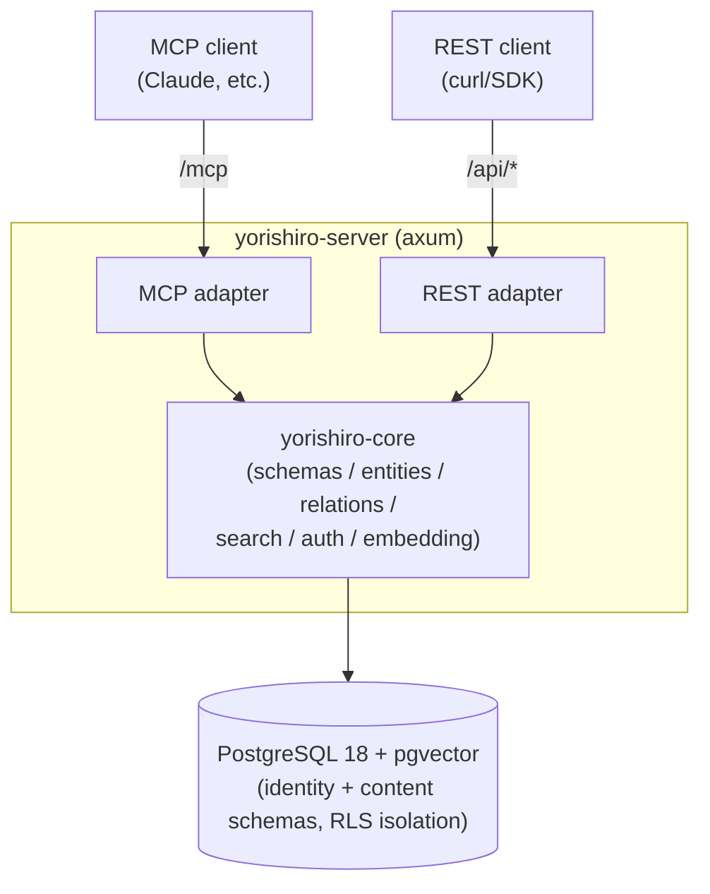

# Yorishiro (依り代)

**English** | [日本語](docs/ja/README.md)

An MCP-native, multi-tenant knowledge store with user-defined schemas.

Users define entity "types" (fields, constraints, relations) as JSON meta-schemas, and
data validated against those schemas can be read and written through both a REST API and
MCP (Model Context Protocol). Fields marked `x-embed` are automatically vector-embedded,
enabling similarity search over natural-language queries.

## Architecture



- **Cargo workspace**: `yorishiro-core` (domain logic) and `yorishiro-server` (HTTP server
  and adapter layer). Only the `yorishiro-server` process accesses the database directly.
- **Two-tier tenancy**: a **tenant** (an organization/account, with one or more human
  **users** attached to it via roles — owner/admin/member/viewer) owns one or more
  **workspaces**; all content (schemas/entities/relations) and API keys belong to exactly
  one workspace. This lets one organization keep several isolated projects (e.g. prod/staging,
  or one workspace per team) without needing separate tenants, and lets several people share
  administrative access to the same tenant.
- **Isolation via RLS**: PostgreSQL Row Level Security is applied to every table. On each
  request, the workspace (and its owning tenant) are resolved from the API key, and data can
  only be reached through a connection that has set the `app.current_tenant`/
  `app.current_workspace` session variables. The application runs as a dedicated role
  (`yorishiro_app`, without `BYPASSRLS`), and control-plane tables
  (`identity.tenants`/`identity.users`/`identity.tenant_memberships`) aren't reachable by
  that role at all — only the admin CLI, running as the migration role, can manage them.
- **Quotas**: a tenant's `max_workspaces` and a workspace's `max_entities` are enforced at
  creation time (workspace creation / entity creation, respectively). Both default to `NULL`
  (unlimited); an operator can set explicit caps per tenant/workspace.
- **Schema versioning**: Re-registering a schema with the same name adds a new version;
  breaking changes (removed fields, type changes, newly required fields, etc.) are reported
  as a diff. Existing entities continue to be validated against the schema version that was
  active when they were created.
- **Single binary**: everything above ships in the single `yorishiro-server` binary, which defaults to a single-tenant deployment (`YORISHIRO_MAX_TENANTS=1`; set it to `0` for unlimited tenants). That same cap also enables a first-run setup wizard (browser UI at `/`, or `POST /setup`) that creates the tenant, workspace, and owner account in one step — no admin CLI needed. Beyond that first account, further account creation is invite-only (`admin create-invite` → `POST /auth/signup` → `POST /auth/login`), and tenant owners/admins can manage members over REST (`/api/members`) without touching the admin CLI.

## Quick start

The server needs an embedding model to start; it defaults to the local ONNX provider, which
needs no external service or configuration beyond the model files themselves — fetch a
768-dimensional BERT-family model first (see
[docs/embedding-providers.md](docs/embedding-providers.md); to use an OpenAI-compatible
endpoint instead, see that same doc):

```console
$ mkdir -p models
$ curl -L -o models/model.onnx \
    https://huggingface.co/Xenova/all-mpnet-base-v2/resolve/main/onnx/model_quantized.onnx
$ curl -L -o models/tokenizer.json \
    https://huggingface.co/Xenova/all-mpnet-base-v2/resolve/main/tokenizer.json
```

### Prebuilt Docker image

Every tag's release publishes `ghcr.io/yotsunagi/yorishiro:vX.Y.Z` (and `:latest`); the
setup-wizard SPA (`web/`) is compiled into the binary, so only the embedding model needs
mounting in. `-d --restart unless-stopped` runs it detached and brings it back up on
reboot/crash:

```console
$ docker run -d --name yorishiro --restart unless-stopped -p 8080:8080 \
    -v "$(pwd)/models:/app/models:ro" \
    -e DATABASE_URL=postgres://... \
    ghcr.io/yotsunagi/yorishiro:latest
```

That's a complete single-tenant deployment as-is — `YORISHIRO_MAX_TENANTS` and `YSR_EMBEDDING_PROVIDER` (plus the ONNX model/tokenizer paths) all already default to the values shown in [docs/setup.md](docs/setup.md), matching the `models/` layout fetched above. See [docs/deployment.md](docs/deployment.md) for running the prebuilt Linux binary from [GitHub Releases](https://github.com/yotsunagi/yorishiro/releases) without Docker, including how to run it in the background via systemd.

### From source (Docker Compose)

Prerequisites: Docker / Docker Compose / make. `make init` builds the images (from the same
multi-stage `Dockerfile` the release image above is built from) and starts PostgreSQL plus
`app`.

```console
$ git clone https://github.com/yotsunagi/yorishiro && cd yorishiro
# (place models/model.onnx and models/tokenizer.json as above)
$ make init
```

Migrations are applied automatically on startup. Visit `http://localhost:8080/` to create
the owner account through the setup wizard — no admin CLI needed. See
[docs/setup.md](docs/setup.md) for the full setup guide, endpoint list, tenant/workspace/
user/API key provisioning, and auth model.

## Documentation

| Document | Contents |
|---|---|
| [docs/setup.md](docs/setup.md) | Full setup guide: startup, endpoints, tenant/workspace/user/API key provisioning, auth & scopes |
| [docs/schema.md](docs/schema.md) | Meta-schema guide for defining entity types and relations |
| [docs/api.md](docs/api.md) | REST API and MCP tool reference |
| [docs/embedding-providers.md](docs/embedding-providers.md) | Configuring embedding providers (`local` ONNX / `openai`-compatible) |
| [docs/configuration.md](docs/configuration.md) | Environment variable / `config.yml` reference |
| [docs/deployment.md](docs/deployment.md) | Production deployment guide |
| [docs/operations.md](docs/operations.md) | Operational notes: backups, rate limiting, observability |

## Development

Day-to-day development commands run through a separate `dev` service (Rust toolchain,
started on demand rather than as part of `make up`):

```console
$ make fmt-check
$ make clippy
$ make test
$ make shell   # ad-hoc cargo/psql/sqlx-cli access
```

Placing an ONNX model under `models/` enables embedding integration tests against the real
model (they're skipped automatically otherwise).

## License

Licensed under the [Business Source License 1.1](LICENSE). Self-hosting (including for
internal/commercial use) is permitted; the only restriction is offering Yorishiro itself as a
competing hosted/managed service. On 2030-07-14 this version automatically converts to the
GNU General Public License, Version 2.0 or later.
