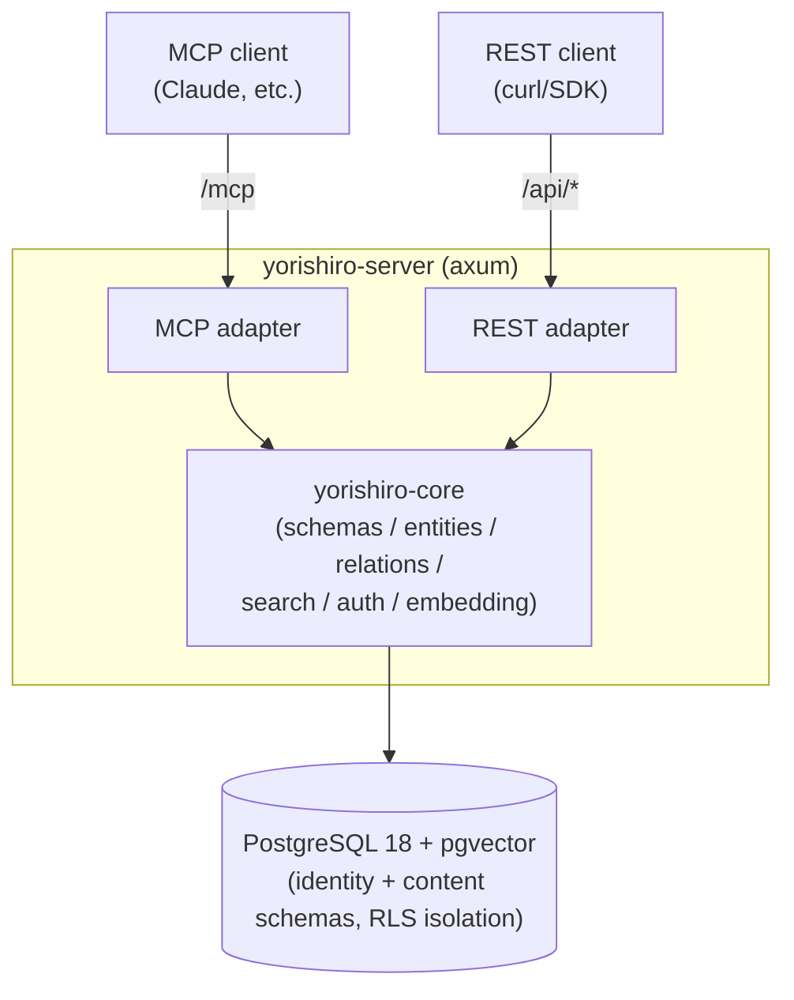

# Yorishiro (依り代)

**English** | [日本語](docs/ja/README.md)

An MCP-native, multi-tenant knowledge store with user-defined schemas.

Users define entity "types" (fields, constraints, relations) as JSON meta-schemas, and
data validated against those schemas can be read and written through both a REST API and
MCP (Model Context Protocol). Fields marked `x-embed` are automatically vector-embedded,
enabling similarity search over natural-language queries.

## Architecture



- **Cargo workspace**: `yorishiro-core` (domain logic) and `yorishiro-server` (HTTP server
  and adapter layer). Only the `yorishiro-server` process accesses the database directly.
- **Two-tier tenancy**: a **tenant** (an organization/account, with one or more human
  **users** attached to it via roles — owner/admin/member/viewer) owns one or more
  **workspaces**; all content (schemas/entities/relations) and API keys belong to exactly
  one workspace. This lets one organization keep several isolated projects (e.g. prod/staging,
  or one workspace per team) without needing separate tenants, and lets several people share
  administrative access to the same tenant.
- **Isolation via RLS**: PostgreSQL Row Level Security is applied to every table. On each
  request, the workspace (and its owning tenant) are resolved from the API key, and data can
  only be reached through a connection that has set the `app.current_tenant`/
  `app.current_workspace` session variables. The application runs as a dedicated role
  (`yorishiro_app`, without `BYPASSRLS`), and control-plane tables
  (`identity.tenants`/`identity.users`/`identity.tenant_memberships`) aren't reachable by
  that role at all — only the admin CLI, running as the migration role, can manage them.
- **Billing-ready quotas**: a tenant's `max_workspaces` and a workspace's `max_entities` are
  enforced at creation time (workspace creation / entity creation, respectively). Both
  default to `NULL` (unlimited), which is the right default for self-hosted deployments; a
  hosted offering can set explicit caps per plan.
- **Schema versioning**: Re-registering a schema with the same name adds a new version;
  breaking changes (removed fields, type changes, newly required fields, etc.) are reported
  as a diff. Existing entities continue to be validated against the schema version that was
  active when they were created.
- **Community / hosted split**: everything above ships in the single `yorishiro-server`
  binary (the community edition) and is all a self-hosted operator needs — set
  `YORISHIRO_MAX_TENANTS=1` to keep it single-tenant. The same setting also enables a
  first-run setup wizard (browser UI at `/`, or `POST /setup`) that creates the tenant,
  workspace, and owner account in one step — no admin CLI needed. Beyond that first account,
  further account creation is invite-only (`admin create-invite` → `POST /auth/signup` →
  `POST /auth/login`), and tenant owners/admins can manage members over REST (`/api/members`)
  without touching the admin CLI. Stripe billing, usage metering, and the admin dashboard SPA
  are hosted-only concerns, developed as a separate product in a private repository
  (`yotsunagi/yorishiro-enterprise`) so they never ship as part of, or add attack surface to,
  the community edition — see [docs/deployment.md](docs/deployment.md#hosted-deployment).

## Community edition vs. hosted edition

| | Community (self-hosted) | Hosted |
|---|---|---|
| Source | This repository (public) | `yotsunagi/yorishiro-enterprise` (private) |
| Tenants | 1 (`YORISHIRO_MAX_TENANTS=1`) | Unlimited |
| Users per tenant | Unlimited | Unlimited |
| Billing | None | Stripe webhook + plan caps ([docs/deployment.md](docs/deployment.md#hosted-deployment)) |
| Admin dashboard SPA | Not included (a separate hosted-only process serves it) | Included |

Signup/login and `/api/members` are part of the core `yorishiro-server` API either way — the
hosted edition only adds billing and the dashboard on top.

## Quick start

Prerequisites: Docker / Docker Compose / make. `make init` builds the images and starts
PostgreSQL plus `app`, a container running the actual release binary from the multi-stage
`Dockerfile` at the repo root (the same image used in production).

An embedding provider must be configured for the server to start. `docker-compose.yml`
already points `app` at the local ONNX provider; here's how to fetch a model for it (needs
no external service):

```console
$ git clone https://github.com/yotsunagi/yorishiro && cd yorishiro

# Place a 768-dimensional BERT-family ONNX model (see docs/embedding-providers.md)
$ mkdir -p models
$ curl -L -o models/model.onnx \
    https://huggingface.co/Xenova/all-mpnet-base-v2/resolve/main/onnx/model_quantized.onnx
$ curl -L -o models/tokenizer.json \
    https://huggingface.co/Xenova/all-mpnet-base-v2/resolve/main/tokenizer.json

$ make init
```

Migrations are applied automatically on startup. Visit `http://localhost:8080/` to create
the owner account through the setup wizard — no admin CLI needed. See
[docs/setup.md](docs/setup.md) for the full setup guide, endpoint list, tenant/workspace/
user/API key provisioning, and auth model.

## Documentation

| Document | Contents |
|---|---|
| [docs/setup.md](docs/setup.md) | Full setup guide: startup, endpoints, tenant/workspace/user/API key provisioning, auth & scopes |
| [docs/schema.md](docs/schema.md) | Meta-schema guide for defining entity types and relations |
| [docs/api.md](docs/api.md) | REST API and MCP tool reference |
| [docs/embedding-providers.md](docs/embedding-providers.md) | Configuring embedding providers (`openai`-compatible / `local` ONNX) |
| [docs/configuration.md](docs/configuration.md) | Environment variable reference |
| [docs/deployment.md](docs/deployment.md) | Production deployment guide |
| [docs/operations.md](docs/operations.md) | Operational notes: backups, rate limiting, observability |

## Development

Day-to-day development commands run through a separate `dev` service (Rust toolchain,
started on demand rather than as part of `make up`):

```console
$ make fmt-check
$ make clippy
$ make test
$ make shell   # ad-hoc cargo/psql/sqlx-cli access
```

Placing an ONNX model under `models/` enables embedding integration tests against the real
model (they're skipped automatically otherwise).

## License

Licensed under the [MIT License](LICENSE).
