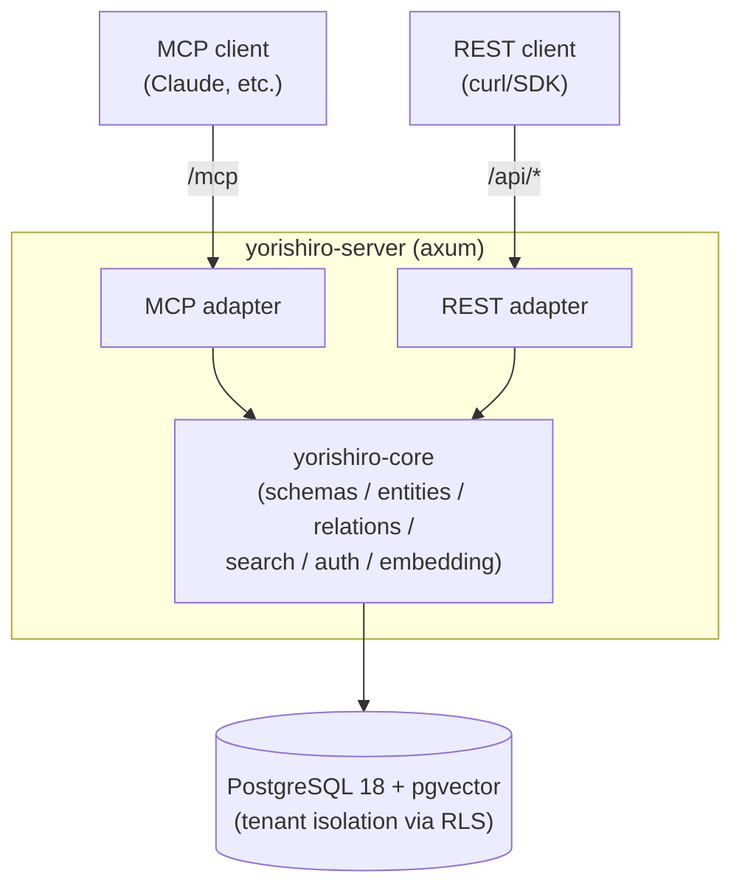

# Yorishiro (依り代)

**English** | [日本語](docs/ja/README.md)

An MCP-native, multi-tenant knowledge store with user-defined schemas.

Users define entity "types" (fields, constraints, relations) as JSON meta-schemas, and
data validated against those schemas can be read and written through both a REST API and
MCP (Model Context Protocol). Fields marked `x-embed` are automatically vector-embedded,
enabling similarity search over natural-language queries.

## Architecture



- **Cargo workspace**: `yorishiro-core` (domain logic) and `yorishiro-server` (HTTP server
  and adapter layer). Only the `yorishiro-server` process accesses the database directly.
- **Tenant isolation**: PostgreSQL Row Level Security is applied to every table. On each
  request, the tenant is resolved from the API key, and data can only be reached through a
  connection that has set the `app.current_tenant` session variable. The application runs
  as a dedicated role (`yorishiro_app`, without `BYPASSRLS`).
- **Schema versioning**: Re-registering a schema with the same name adds a new version;
  breaking changes (removed fields, type changes, newly required fields, etc.) are reported
  as a diff. Existing entities continue to be validated against the schema version that was
  active when they were created.

## Quick start

Prerequisites: Docker / Docker Compose / make. `make init` builds the images and starts
PostgreSQL plus `app`, a container running the actual release binary from the multi-stage
`Dockerfile` at the repo root (the same image used in production).

An embedding provider must be configured for the server to start. `docker-compose.yml`
already points `app` at the local ONNX provider; here's how to fetch a model for it (needs
no external service):

```console
$ git clone https://github.com/yotsunagi/yorishiro && cd yorishiro

# Place a 768-dimensional BERT-family ONNX model (see docs/embedding-providers.md)
$ mkdir -p models
$ curl -L -o models/model.onnx \
    https://huggingface.co/Xenova/all-mpnet-base-v2/resolve/main/onnx/model_quantized.onnx
$ curl -L -o models/tokenizer.json \
    https://huggingface.co/Xenova/all-mpnet-base-v2/resolve/main/tokenizer.json

$ make init
```

Migrations are applied automatically on startup. See [docs/setup.md](docs/setup.md) for
the full setup guide, endpoint list, tenant/API key provisioning, and auth model.

## Documentation

| Document | Contents |
|---|---|
| [docs/setup.md](docs/setup.md) | Full setup guide: startup, endpoints, tenant/API key provisioning, auth & scopes |
| [docs/schema.md](docs/schema.md) | Meta-schema guide for defining entity types and relations |
| [docs/api.md](docs/api.md) | REST API and MCP tool reference |
| [docs/embedding-providers.md](docs/embedding-providers.md) | Configuring embedding providers (`openai`-compatible / `local` ONNX) |
| [docs/configuration.md](docs/configuration.md) | Environment variable reference |
| [docs/deployment.md](docs/deployment.md) | Production deployment guide |
| [docs/operations.md](docs/operations.md) | Operational notes: backups, rate limiting, observability |

## Development

Day-to-day development commands run through a separate `dev` service (Rust toolchain,
started on demand rather than as part of `make up`):

```console
$ make fmt-check
$ make clippy
$ make test
$ make shell   # ad-hoc cargo/psql/sqlx-cli access
```

Placing an ONNX model under `models/` enables embedding integration tests against the real
model (they're skipped automatically otherwise).

## License

Licensed under the [MIT License](LICENSE).
