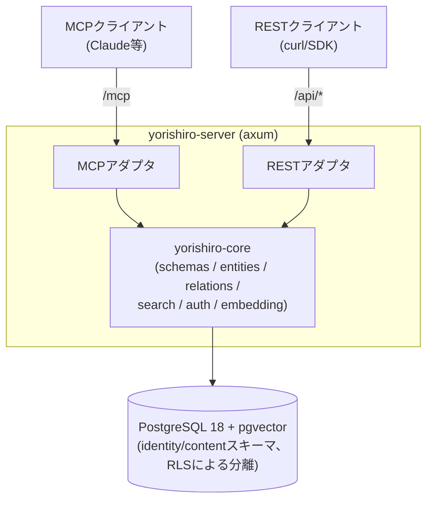

# Yorishiro(依り代)

[English](../../README.md) | **日本語**

ユーザー定義スキーマを持つ、MCPネイティブなマルチテナント・ナレッジストア。

エンティティの「型」(フィールド・制約・リレーション)を利用者がJSONメタスキーマとして定義し、そのスキーマで検証されたデータをREST APIとMCP(Model Context Protocol)の両方から読み書きできます。`x-embed`を付けたフィールドは自動でベクトル埋め込みされ、自然文クエリによる類似検索ができます。

## アーキテクチャ



- cargo workspace
  - `yorishiro-core`(ドメインロジック)と`yorishiro-server`(HTTPサーバ・アダプタ層)で構成されます。
  - DBへ直接アクセスするのは`yorishiro-server`プロセスのみです。
- 2階層のテナント構造
  - **テナント**(組織/アカウント)は複数の人間の**ユーザー**をowner/admin/member/viewerのロールで紐付けられ、複数の**ワークスペース**を持ちます。
  - 全てのコンテンツ(スキーマ/エンティティ/リレーション)とAPIキーはちょうど1つのワークスペースに属します。
  - これにより1つの組織内で複数の独立したプロジェクト(本番/ステージング、チームごとのワークスペースなど)をテナントを分けずに運用でき、複数人で同一テナントの管理権限を共有できます。
- RLSによる分離
  - 全テーブルにPostgreSQLのRow Level Securityを適用します。
  - リクエストごとにAPIキーからワークスペース(とその所属テナント)を解決し、セッション変数`app.current_tenant`/`app.current_workspace`を設定したコネクションでのみデータへ到達できます。
  - アプリは専用ロール(`yorishiro_app`、`BYPASSRLS`なし)で動作し、制御プレーンのテーブル(`identity.tenants`/`identity.users`/`identity.tenant_memberships`)にはこのロールから一切アクセスできません(マイグレーションロールで動く管理CLIのみが操作可能です)。
- クォータ
  - テナントの`max_workspaces`とワークスペースの`max_entities`は、それぞれワークスペース作成時・エンティティ作成時に強制されます。
  - どちらもデフォルトは`NULL`(無制限)で、運用者がテナント/ワークスペースごとに明示的な上限を設定できます。
- スキーマバージョニング
  - 同名スキーマの再登録は新バージョンとして追加され、破壊的変更(フィールド削除・型変更・必須化など)は差分として報告されます。
  - 既存エンティティは作成時点のスキーマバージョンに対して検証され続けます。
- 単一バイナリ
  - 上記は全て単一の`yorishiro-server`バイナリに含まれており、既定でシングルテナント構成(`YORISHIRO_MAX_TENANTS=1`)として動作します(無制限にするには`0`を設定)。
  - この上限は初回セットアップウィザード(`/`のブラウザUI、または`POST /setup`)も有効にし、テナント・ワークスペース・ownerアカウントを一括作成できます。管理CLIは不要です。
  - 最初のアカウント以降は招待制のみ(`admin create-invite` → `POST /auth/signup` → `POST /auth/login`)です。
  - テナントのowner/adminは管理CLIを使わず、メンバー(`/api/members`)とワークスペース(`/api/workspaces`)をREST経由または同じブラウザUIから管理できます。

## クイックスタート

詳しいガイドは[docs/ja/setup.md](setup.md)を参照してください(ビルド済みバイナリでの起動、systemdでのバックグラウンド運用を含みます)。最短経路はDockerです。

1. 埋め込みモデルを取得します(既定のローカルONNXプロバイダは外部サービスを必要としません)。

   ```console
   $ mkdir -p models
   $ curl -L -o models/model.onnx \
       https://huggingface.co/Xenova/all-mpnet-base-v2/resolve/main/onnx/model_quantized.onnx
   $ curl -L -o models/tokenizer.json \
       https://huggingface.co/Xenova/all-mpnet-base-v2/resolve/main/tokenizer.json
   ```

2. サーバを起動します。

   ```console
   $ docker run -d --name yorishiro --restart unless-stopped -p 8080:8080 \
       -v "$(pwd)/models:/app/models:ro" \
       -e DATABASE_URL=postgres://... \
       ghcr.io/yotsunagi/yorishiro:latest
   ```

   これだけでシングルテナント構成として完全に動作します。
3. `http://localhost:8080/`にアクセスし、セットアップウィザードでownerアカウントを作成します。

ソースからビルドする場合は、リポジトリをcloneして手順1と同様にモデルファイルを配置した後、`make init`(Docker Compose、makeが必要)がPostgreSQLとアプリを起動します。

```console
$ git clone https://github.com/yotsunagi/yorishiro && cd yorishiro
$ make init
```

## ドキュメント一覧

| ドキュメント | 内容 |
|---|---|
| [docs/ja/setup.md](setup.md) | セットアップ手順一式(起動・エンドポイント・テナント/ワークスペース/ユーザー/APIキー発行・認証とscope) |
| [docs/ja/schema.md](schema.md) | エンティティ型・リレーションを定義するメタスキーマガイド |
| [docs/ja/api.md](api.md) | REST APIとMCPツールのリファレンス |
| [docs/ja/embedding-providers.md](embedding-providers.md) | 埋め込みプロバイダの設定(ローカル`local` ONNX / `openai`互換) |
| [docs/ja/configuration.md](configuration.md) | 環境変数/`config.yml`リファレンス |
| [docs/ja/deployment.md](deployment.md) | 本番デプロイ手順 |
| [docs/ja/operations.md](operations.md) | 運用上の注意(バックアップ・レート制限・可観測性) |

## 開発

日々の開発コマンドは、`app`とは別の`dev`サービス(Rustツールチェーン、`make up`では起動されず必要な時だけ起動)経由で実行します。

```console
$ make fmt-check
$ make clippy
$ make test
$ make shell   # cargo/psql/sqlx-cliへの単発アクセス
```

`models/`にONNXモデルを置くと、実モデルでの埋め込み統合テストが有効になります(無い場合は自動スキップ)。

## ライセンス

[Business Source License 1.1](../../LICENSE)。自己ホスティング(商用・社内利用を含む)は自由に行えます。制限されるのはYorishiro自体を競合するホスティング／マネージドサービスとして提供することのみです。2030-07-14に自動的にGNU General Public License, Version 2.0以降へ移行します。
