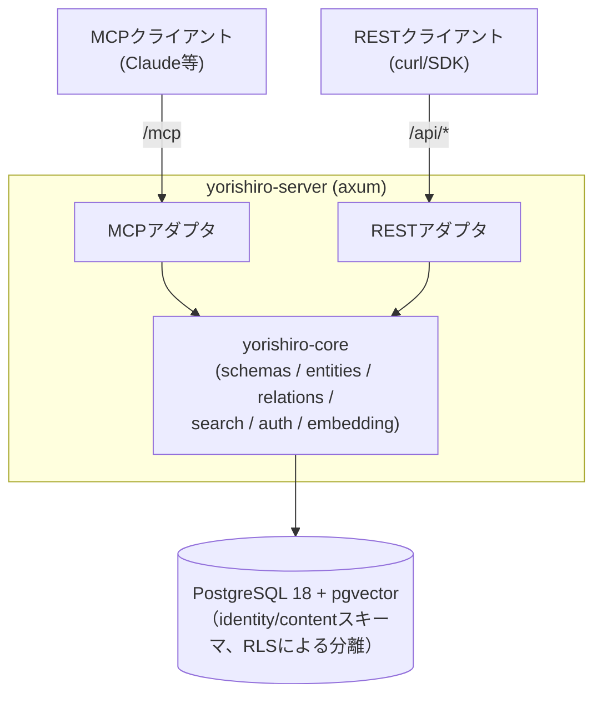

# Yorishiro（依り代）

[English](../../README.md) | **日本語**

ユーザー定義スキーマを持つ、MCPネイティブなマルチテナント・ナレッジストア。

エンティティの「型」（フィールド・制約・リレーション）を利用者がJSONメタスキーマとして定義し、
そのスキーマで検証されたデータをREST APIとMCP（Model Context Protocol）の両方から読み書きできます。
`x-embed`を付けたフィールドは自動でベクトル埋め込みされ、自然文クエリによる類似検索ができます。

## アーキテクチャ



- **cargo workspace**: `yorishiro-core`（ドメインロジック）と`yorishiro-server`（HTTPサーバ・アダプタ層）。
  DBへ直接アクセスするのは`yorishiro-server`プロセスのみ。
- **2階層のテナント構造**: **テナント**（組織/アカウント。owner/admin/member/viewerの
  ロールで複数の人間の**ユーザー**を紐付け可能）が複数の**ワークスペース**を持ち、
  全てのコンテンツ（スキーマ/エンティティ/リレーション）とAPIキーはちょうど1つの
  ワークスペースに属する。これにより1つの組織内で複数の独立したプロジェクト
  （本番/ステージング、チームごとのワークスペースなど）を、テナントを分けずに
  運用でき、また複数人で同一テナントの管理権限を共有できる。
- **RLSによる分離**: 全テーブルにPostgreSQLのRow Level Securityを適用。リクエストごとに
  APIキーからワークスペース（とその所属テナント）を解決し、セッション変数
  `app.current_tenant`/`app.current_workspace`を設定したコネクションでのみデータへ
  到達できる。アプリは専用ロール（`yorishiro_app`、`BYPASSRLS`なし）で動作し、
  制御プレーンのテーブル（`identity.tenants`/`identity.users`/
  `identity.tenant_memberships`）にはこのロールから一切アクセスできない
  （マイグレーションロールで動く管理CLIのみが操作可能）。
- **課金対応のクォータ**: テナントの`max_workspaces`とワークスペースの`max_entities`は、
  それぞれワークスペース作成時・エンティティ作成時に強制される。どちらもデフォルトは
  `NULL`（無制限）で、これはセルフホスト運用に適した既定値。ホスティング提供時は
  プランごとに明示的な上限を設定できる。
- **スキーマバージョニング**: 同名スキーマの再登録は新バージョンとして追加され、破壊的変更
  （フィールド削除・型変更・必須化など）は差分として報告される。既存エンティティは
  作成時点のスキーマバージョンに対して検証され続ける。
- **コミュニティ版とホスティング版の分離**: 上記は全て単一の`yorishiro-server`バイナリ
  （コミュニティ版）に含まれており、セルフホスト運用に必要なのはこれだけ。
  `YORISHIRO_MAX_TENANTS=1`を設定すればシングルテナント構成になる。同じ設定は初回
  セットアップウィザード（`/`のブラウザUI、または`POST /setup`）も有効にし、テナント・
  ワークスペース・ownerアカウントを一括作成できる — 管理CLIは不要。最初のアカウント以降は
  招待制のみ（`admin create-invite` → `POST /auth/signup` → `POST /auth/login`）で、
  テナントのowner/adminは管理CLIを使わずともREST（`/api/members`）でメンバーを管理できる。
  Stripe課金・使用量計測・管理ダッシュボードSPAはホスティング版固有の関心事であり、
  コミュニティ版に一切含まれず攻撃対象領域を増やさないよう、別プロダクトとして非公開の
  リポジトリ（`yotsunagi/yorishiro-enterprise`）で開発されている。詳細は
  [docs/ja/deployment.md](deployment.md#ホスティング版のデプロイ)を参照。

## コミュニティ版とホスティング版の比較

| | コミュニティ版（セルフホスト） | ホスティング版 |
|---|---|---|
| ソース | このリポジトリ（公開） | `yotsunagi/yorishiro-enterprise`（非公開） |
| テナント数 | 1（`YORISHIRO_MAX_TENANTS=1`） | 無制限 |
| テナントあたりのユーザー数 | 無制限 | 無制限 |
| 課金 | なし | Stripe Webhook + プラン上限（[docs/ja/deployment.md](deployment.md#ホスティング版のデプロイ)） |
| 管理ダッシュボードSPA | 含まれない（別のホスティング版限定プロセスが配信） | 含まれる |

サインアップ/ログインと`/api/members`はどちらの版でもコアの`yorishiro-server`のAPIの一部
であり、ホスティング版はその上に課金機能とダッシュボードを追加するのみ。

## クイックスタート

必要なもの: Docker / Docker Compose / make。`make init`でイメージをビルドし、PostgreSQLと
`app`（リポジトリルートのマルチステージ`Dockerfile`が生成する、本番と同じreleaseバイナリを
実行するコンテナ）を起動します。

埋め込みプロバイダの設定が起動に必須です。`docker-compose.yml`は既に`app`をローカルONNX
プロバイダに向けているので、あとはモデルを配置するだけです（外部サービス不要）:

```console
$ git clone https://github.com/yotsunagi/yorishiro && cd yorishiro

# 768次元のBERT系ONNXモデルを配置（docs/ja/embedding-providers.md参照）
$ mkdir -p models
$ curl -L -o models/model.onnx \
    https://huggingface.co/Xenova/all-mpnet-base-v2/resolve/main/onnx/model_quantized.onnx
$ curl -L -o models/tokenizer.json \
    https://huggingface.co/Xenova/all-mpnet-base-v2/resolve/main/tokenizer.json

$ make init
```

起動時にマイグレーションが自動適用されます。`http://localhost:8080/`にアクセスすると
セットアップウィザードでownerアカウントを作成できます — 管理CLIは不要です。詳しいセットアップ手順（起動方法、
エンドポイント一覧、テナント/ワークスペース/ユーザー/APIキーの発行、認証モデル）は
[docs/ja/setup.md](setup.md)を参照してください。

## ドキュメント一覧

| ドキュメント | 内容 |
|---|---|
| [docs/ja/setup.md](setup.md) | セットアップ手順一式（起動・エンドポイント・テナント/ワークスペース/ユーザー/APIキー発行・認証とscope） |
| [docs/ja/schema.md](schema.md) | エンティティ型・リレーションを定義するメタスキーマガイド |
| [docs/ja/api.md](api.md) | REST APIとMCPツールのリファレンス |
| [docs/ja/embedding-providers.md](embedding-providers.md) | 埋め込みプロバイダの設定（`openai`互換 / ローカル`local` ONNX） |
| [docs/ja/configuration.md](configuration.md) | 環境変数リファレンス |
| [docs/ja/deployment.md](deployment.md) | 本番デプロイ手順 |
| [docs/ja/operations.md](operations.md) | 運用上の注意（バックアップ・レート制限・可観測性） |

## 開発

日々の開発コマンドは、`app`とは別の`dev`サービス（Rustツールチェーン、`make up`では
起動されず必要な時だけ起動）経由で実行します:

```console
$ make fmt-check
$ make clippy
$ make test
$ make shell   # cargo/psql/sqlx-cliへの単発アクセス
```

`models/`にONNXモデルを置くと、実モデルでの埋め込み統合テストが有効になります
（無い場合は自動スキップ）。

## ライセンス

[MITライセンス](../../LICENSE)。
