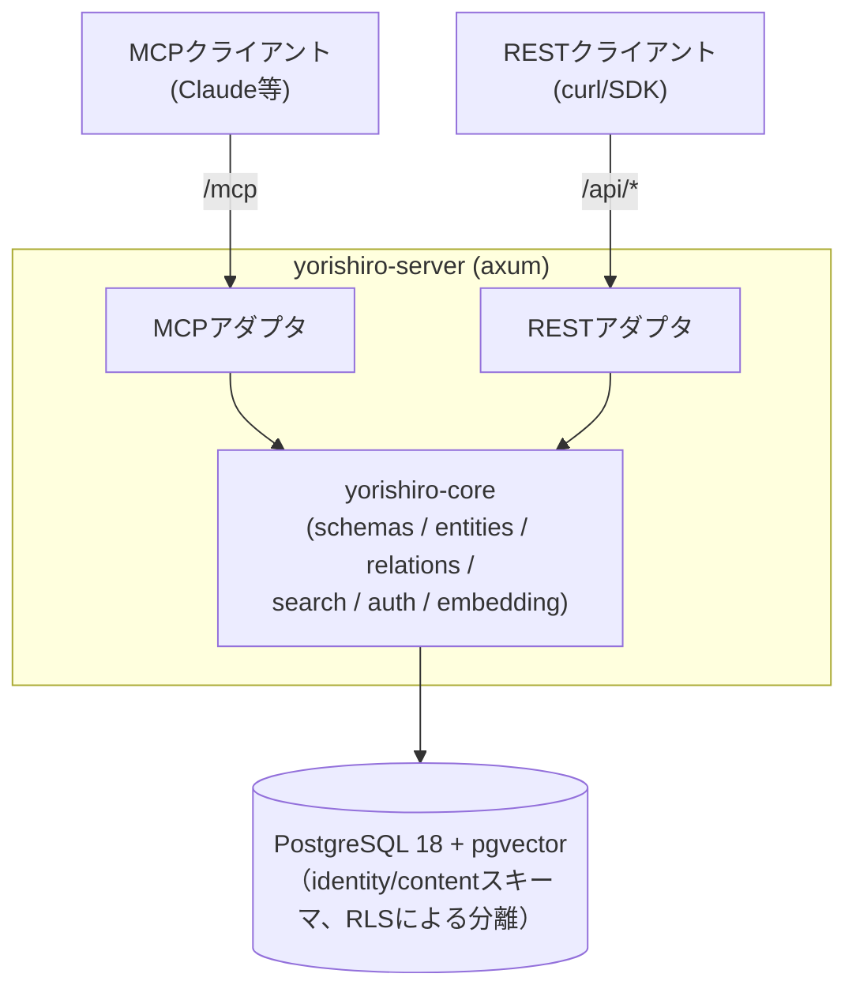

# Yorishiro（依り代）

[English](../../README.md) | **日本語**

ユーザー定義スキーマを持つ、MCPネイティブなマルチテナント・ナレッジストア。

エンティティの「型」（フィールド・制約・リレーション）を利用者がJSONメタスキーマとして定義し、
そのスキーマで検証されたデータをREST APIとMCP（Model Context Protocol）の両方から読み書きできます。
`x-embed`を付けたフィールドは自動でベクトル埋め込みされ、自然文クエリによる類似検索ができます。

## アーキテクチャ



- **cargo workspace**: `yorishiro-core`（ドメインロジック）と`yorishiro-server`（HTTPサーバ・アダプタ層）。
  DBへ直接アクセスするのは`yorishiro-server`プロセスのみ。
- **2階層のテナント構造**: **テナント**（組織/アカウント。owner/admin/member/viewerの
  ロールで複数の人間の**ユーザー**を紐付け可能）が複数の**ワークスペース**を持ち、
  全てのコンテンツ（スキーマ/エンティティ/リレーション）とAPIキーはちょうど1つの
  ワークスペースに属する。これにより1つの組織内で複数の独立したプロジェクト
  （本番/ステージング、チームごとのワークスペースなど）を、テナントを分けずに
  運用でき、また複数人で同一テナントの管理権限を共有できる。
- **RLSによる分離**: 全テーブルにPostgreSQLのRow Level Securityを適用。リクエストごとに
  APIキーからワークスペース（とその所属テナント）を解決し、セッション変数
  `app.current_tenant`/`app.current_workspace`を設定したコネクションでのみデータへ
  到達できる。アプリは専用ロール（`yorishiro_app`、`BYPASSRLS`なし）で動作し、
  制御プレーンのテーブル（`identity.tenants`/`identity.users`/
  `identity.tenant_memberships`）にはこのロールから一切アクセスできない
  （マイグレーションロールで動く管理CLIのみが操作可能）。
- **クォータ**: テナントの`max_workspaces`とワークスペースの`max_entities`は、
  それぞれワークスペース作成時・エンティティ作成時に強制される。どちらもデフォルトは
  `NULL`（無制限）で、運用者がテナント/ワークスペースごとに明示的な上限を設定できる。
- **スキーマバージョニング**: 同名スキーマの再登録は新バージョンとして追加され、破壊的変更
  （フィールド削除・型変更・必須化など）は差分として報告される。既存エンティティは
  作成時点のスキーマバージョンに対して検証され続ける。
- **単一バイナリ**: 上記は全て単一の`yorishiro-server`バイナリに含まれている。
  `YORISHIRO_MAX_TENANTS=1`を設定すればシングルテナント構成になる。同じ設定は初回
  セットアップウィザード（`/`のブラウザUI、または`POST /setup`）も有効にし、テナント・
  ワークスペース・ownerアカウントを一括作成できる — 管理CLIは不要。最初のアカウント以降は
  招待制のみ（`admin create-invite` → `POST /auth/signup` → `POST /auth/login`）で、
  テナントのowner/adminは管理CLIを使わずともREST（`/api/members`）でメンバーを管理できる。

## クイックスタート

埋め込みプロバイダの設定が起動に必須です。以下の例では外部サービス不要のローカルONNX
プロバイダを使うので、まず768次元のBERT系ONNXモデルを配置します
（[docs/ja/embedding-providers.md](embedding-providers.md)参照）:

```console
$ mkdir -p models
$ curl -L -o models/model.onnx \
    https://huggingface.co/Xenova/all-mpnet-base-v2/resolve/main/onnx/model_quantized.onnx
$ curl -L -o models/tokenizer.json \
    https://huggingface.co/Xenova/all-mpnet-base-v2/resolve/main/tokenizer.json
```

### ビルド済みDockerイメージ

各タグのリリースで`ghcr.io/yotsunagi/yorishiro:vX.Y.Z`（および`:latest`）が公開されます。
セットアップウィザードのSPA（`web/`）は既に同梱済みなので、埋め込みモデルをマウント
するだけです。`-d --restart unless-stopped`でバックグラウンド起動し、再起動/クラッシュ後も
自動的に立ち上がり直します:

```console
$ docker run -d --name yorishiro --restart unless-stopped -p 8080:8080 \
    -v "$(pwd)/models:/app/models:ro" \
    -e DATABASE_URL=postgres://... \
    -e YSR_EMBEDDING_PROVIDER=local \
    -e YSR_ONNX_MODEL_PATH=models/model.onnx -e YSR_ONNX_TOKENIZER_PATH=models/tokenizer.json \
    -e YSR_WEB_DIR=web -e YORISHIRO_MAX_TENANTS=1 \
    ghcr.io/yotsunagi/yorishiro:latest
```

Dockerを使わずビルド済みのLinuxバイナリを直接動かす方法（systemdでのバックグラウンド
起動を含む）は[docs/ja/deployment.md](deployment.md)を参照してください。

### ソースからビルド（Docker Compose）

必要なもの: Docker / Docker Compose / make。`make init`でイメージをビルドし
（上記のリリースイメージと同じマルチステージ`Dockerfile`を使用）、PostgreSQLと`app`を
起動します。

```console
$ git clone https://github.com/yotsunagi/yorishiro && cd yorishiro
# （上記と同様にmodels/model.onnx、models/tokenizer.jsonを配置）
$ make init
```

起動時にマイグレーションが自動適用されます。`http://localhost:8080/`にアクセスすると
セットアップウィザードでownerアカウントを作成できます — 管理CLIは不要です。詳しいセットアップ手順（起動方法、
エンドポイント一覧、テナント/ワークスペース/ユーザー/APIキーの発行、認証モデル）は
[docs/ja/setup.md](setup.md)を参照してください。

## ドキュメント一覧

| ドキュメント | 内容 |
|---|---|
| [docs/ja/setup.md](setup.md) | セットアップ手順一式（起動・エンドポイント・テナント/ワークスペース/ユーザー/APIキー発行・認証とscope） |
| [docs/ja/schema.md](schema.md) | エンティティ型・リレーションを定義するメタスキーマガイド |
| [docs/ja/api.md](api.md) | REST APIとMCPツールのリファレンス |
| [docs/ja/embedding-providers.md](embedding-providers.md) | 埋め込みプロバイダの設定（`openai`互換 / ローカル`local` ONNX） |
| [docs/ja/configuration.md](configuration.md) | 環境変数リファレンス |
| [docs/ja/deployment.md](deployment.md) | 本番デプロイ手順 |
| [docs/ja/operations.md](operations.md) | 運用上の注意（バックアップ・レート制限・可観測性） |

## 開発

日々の開発コマンドは、`app`とは別の`dev`サービス（Rustツールチェーン、`make up`では
起動されず必要な時だけ起動）経由で実行します:

```console
$ make fmt-check
$ make clippy
$ make test
$ make shell   # cargo/psql/sqlx-cliへの単発アクセス
```

`models/`にONNXモデルを置くと、実モデルでの埋め込み統合テストが有効になります
（無い場合は自動スキップ）。

## ライセンス

[Business Source License 1.1](../../LICENSE)。自己ホスティング（商用・社内利用を含む）は自由に行えます。制限されるのは
Yorishiro自体を競合するホスティング／マネージドサービスとして提供することのみです。2030-07-14に自動的に
GNU General Public License, Version 2.0以降へ移行します。
