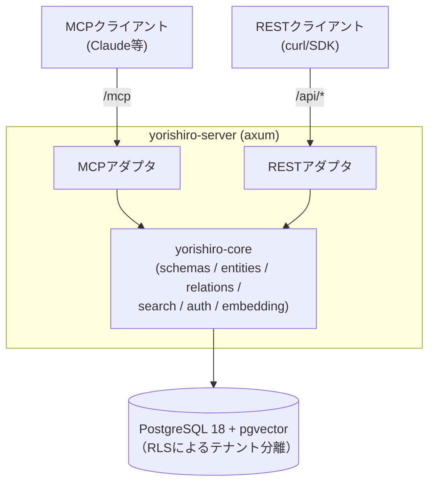

# Yorishiro（依り代）

[English](../../README.md) | **日本語**

ユーザー定義スキーマを持つ、MCPネイティブなマルチテナント・ナレッジストア。

エンティティの「型」（フィールド・制約・リレーション）を利用者がJSONメタスキーマとして定義し、
そのスキーマで検証されたデータをREST APIとMCP（Model Context Protocol）の両方から読み書きできます。
`x-embed`を付けたフィールドは自動でベクトル埋め込みされ、自然文クエリによる類似検索ができます。

## アーキテクチャ



- **cargo workspace**: `yorishiro-core`（ドメインロジック）と`yorishiro-server`（HTTPサーバ・アダプタ層）。
  DBへ直接アクセスするのは`yorishiro-server`プロセスのみ。
- **テナント分離**: 全テーブルにPostgreSQLのRow Level Securityを適用。リクエストごとに
  APIキーからテナントを解決し、セッション変数`app.current_tenant`を設定したコネクションでのみ
  データへ到達できる。アプリは専用ロール（`yorishiro_app`、`BYPASSRLS`なし）で動作する。
- **スキーマバージョニング**: 同名スキーマの再登録は新バージョンとして追加され、破壊的変更
  （フィールド削除・型変更・必須化など）は差分として報告される。既存エンティティは
  作成時点のスキーマバージョンに対して検証され続ける。

## クイックスタート

必要なもの: Docker / Docker Compose。`docker compose up`で起動するのはPostgreSQLと
開発コンテナ（`app`、Rustツールチェーン入り）で、サーバ自体は開発コンテナ内で
`cargo run`します。

埋め込みプロバイダの設定が起動に必須です。外部サービス不要で完結するローカルONNXの例:

```console
$ git clone https://github.com/yotsunagi/yorishiro && cd yorishiro

# 768次元のBERT系ONNXモデルを配置（docs/ja/embedding-providers.md参照）
$ mkdir -p models
$ curl -L -o models/model.onnx \
    https://huggingface.co/Xenova/all-mpnet-base-v2/resolve/main/onnx/model_quantized.onnx
$ curl -L -o models/tokenizer.json \
    https://huggingface.co/Xenova/all-mpnet-base-v2/resolve/main/tokenizer.json

$ docker compose up -d --build
$ docker compose exec \
    -e YSR_EMBEDDING_PROVIDER=local \
    -e YSR_ONNX_MODEL_PATH=models/model.onnx \
    -e YSR_ONNX_TOKENIZER_PATH=models/tokenizer.json \
    app cargo run -p yorishiro-server
```

起動時にマイグレーションが自動適用されます。詳しいセットアップ手順（起動方法、
エンドポイント一覧、テナント/APIキーの発行、認証モデル）は
[docs/ja/setup.md](setup.md)を参照してください。

## ドキュメント一覧

| ドキュメント | 内容 |
|---|---|
| [docs/ja/setup.md](setup.md) | セットアップ手順一式（起動・エンドポイント・テナント/APIキー発行・認証とscope） |
| [docs/ja/schema.md](schema.md) | エンティティ型・リレーションを定義するメタスキーマガイド |
| [docs/ja/api.md](api.md) | REST APIとMCPツールのリファレンス |
| [docs/ja/embedding-providers.md](embedding-providers.md) | 埋め込みプロバイダの設定（`openai`互換 / ローカル`local` ONNX） |
| [docs/ja/configuration.md](configuration.md) | 環境変数リファレンス |
| [docs/ja/deployment.md](deployment.md) | 本番デプロイ手順 |
| [docs/ja/operations.md](operations.md) | 運用上の注意（バックアップ・レート制限・可観測性） |

## 開発

```console
# フォーマット・lint・テスト（要: 起動中のPostgreSQL、DATABASE_URL）
$ cargo fmt --check
$ cargo clippy --workspace --all-targets -- -D warnings
$ cargo test --workspace
```

`models/`にONNXモデルを置くと、実モデルでの埋め込み統合テストが有効になります
（無い場合は自動スキップ）。

## ライセンス

[MITライセンス](../../LICENSE)。
